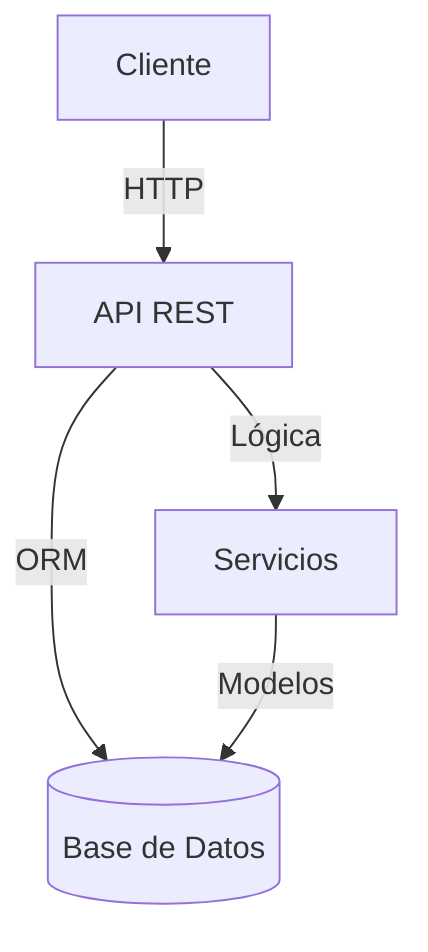

# Arquitectura del Backend

Este documento describe la arquitectura del backend del proyecto Precios.

## Diagrama General

## Componentes Principales
- **API REST**: Expone los endpoints para interacción con el frontend y otros sistemas.
- **Servicios**: Lógica de negocio y procesamiento de datos.
- **Modelos**: Representación de entidades y acceso a la base de datos.
- **Middleware**: Autenticación, autorización y validaciones.

## Estructura de Rutas
- Prefijos de API:
  - Público: `/publico`
  - Administrativo: `/admin`
- Montaje de routers (desde `server.js`):
  - `/publico` → `middleware/Publico` monta: `busqueda`, `estadistica`, `categorias`, `productos`, `chatbot`
  - `/admin` → `middleware/Admin` monta: `user`

Esto determina las rutas reales documentadas en Endpoints.

## Flujo de Datos
Describir cómo fluye la información desde el cliente hasta la base de datos y viceversa.

---

- [Volver al README del backend](./README.md)
- [Definición técnica](./definicion_tecnica.md)
- [Endpoints](./endpoints.md)