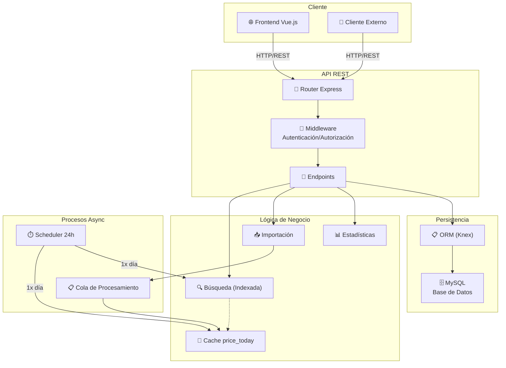

# 🏗️ Arquitectura del Backend

Descripción del diseño arquitectónico, componentes y flujo de datos del backend de Precios.

## 📐 Diagrama de Arquitectura General



## 🧩 Componentes Principales

### 1. Capa de Presentación (API REST)
**Localización**: `routes/*.js`

- Define endpoints HTTP (GET, POST, PUT, DELETE)
- Entrada: Query params, body JSON
- Salida: JSON estructurado
- Mantiene convenciones de respuesta consistentes

**Ejemplo**:
```
GET /publico/busqueda/precios?product_name=leche
→ Router busqueda.js → Controlador → Respuesta JSON
```

### 2. Capa de Autenticación y Autorización
**Localización**: `middleware/Publico.js`, `middleware/Admin.js`

- Valida identidad del usuario
- Verifica permisos por rol
- Monta subrutas según acceso
- Control granular de endpoints

**Prefijos**:
- `/publico/*` → Acceso público
- `/admin/*` → Acceso administrativo

### 3. Capa de Lógica de Negocio
**Localización**: `controllers/`, `helpers/`

#### 3.1 Búsqueda de Productos
- **Archivo**: `controllers/busqueda_productos.js`
- **Tipo**: Indexación en memoria
- **Características**:
  - Índice por iniciales de palabras
  - Búsqueda case-insensitive
  - Actualización dinámica sin regeneración completa
- **Performance**: O(letras) ≈ Ultra rápido

#### 3.2 Importación de Precios
- **Archivo**: `controllers/importar_productos.js`
- **Tipo**: Cola asíncrona con procesamiento
- **Características**:
  - Validación inteligente
  - Transaccionalidad
  - Deduplicación
  - Cálculo de estadísticas

#### 3.3 Procesamiento Asíncrono
- **Archivo**: `helpers/processing.js`
- **Características**:
  - Cola en memoria
  - Procesamiento en ciclos (max 50 items/ciclo)
  - Re-intento de items fallidos
  - Callback al vaciar cola

### 4. Capa de Acceso a Datos
**Localización**: `models/*.js`, `db/`

- ORM: **Knex.js**
- Base de datos: **MySQL**
- Transacciones: **Soporte completo**
- Migrations: **Knex migrations**

### 5. Capa de Cache
**Localización**: `price_today` tabla

- Cache de precios actuales
- Actualizado cada 24h
- Soporte para búsqueda rápida
- Se sincroniza con estructura de búsqueda

## 🔄 Flujos de Datos

### Flujo 1: Búsqueda de Precios (Lectura)

```
Cliente
   ↓
GET /publico/busqueda/precios?product_name=X
   ↓
Router (busqueda.js)
   ↓
hacer_busqueda(termino)
   ↓
busqueda_productos.busqueda(termino)
   ├─ Convierte a minúsculas (case-insensitive)
   ├─ Busca en estructura indexada
   └─ Retorna máx N resultados
   ↓
Enriquecimiento de datos
   ├─ Agrega empresa (desde global.enterprice_diccio)
   ├─ Agrega sucursales (desde global.branch_enterprice_diccio)
   └─ Formatea respuesta
   ↓
Respuesta JSON
{
  "stat": true,
  "items": [
    {
      "product_id": "...",
      "name": "...",
      "price": 1200,
      "branch_id": 10,
      "empresa": {...},
      "locales": [...]
    }
  ]
}
```

### Flujo 2: Importación de Precios (Escritura)

```
Sistema Externo
   ↓
POST /publico/productos/importar
Body: { key: KEY_INT, lst_importa: [...] }
   ↓
Validar clave de seguridad (KEY_INT)
   ↓
Agregar a colaProcProductos (en memoria)
   ↓
Responder inmediatamente al cliente
   ↓
[ASÍNCRONO - en background]
   ↓
Worker procesa cola cada 2 segundos
   ├─ Max 50 items por ciclo
   └─ Máx 1 error por item (reintenta)
   ↓
Para cada item:
   procesar_articulo(item)
   ├─ Normalizar nombre y categoría
   ├─ Obtener o crear producto
   ├─ Obtener o crear categoría
   ├─ Crear relación producto-categoría
   ├─ Procesar precio
   │  ├─ Si es nuevo precio → Insertar en price
   │  ├─ Si es actualización → Actualizar price_today
   │  ├─ Si es cambio significativo → Calcular estadísticas
   │  └─ Actualizar estructura de búsqueda
   └─ Dentro de transacción (TODO O NADA)
   ↓
Actualizar contadores globales
   ├─ cant_price (total en price)
   └─ precios_hoy (total en price_today)
   ↓
Cola vacía → Callback onEmpty
   └─ [Futuro] Actualizar serie compilada
```

### Flujo 3: Actualización de Precios Actuales (Scheduler 24h)

```
Server inicia
   ↓
Programa scheduler cada 24 horas
   ↓
Cada 24h:
   ├─ Fork proceso hijo: actualizar_price_today.js
   ├─ Procesa en chunks de 5000 combinaciones
   │  ├─ product_id + branch_id única
   │  ├─ Selecciona precio más reciente (últimos 30 días)
   │  ├─ Excluye precios = 0
   │  └─ Usa transacción por chunk
   └─ Elimina precios antiguos de price_today
   ↓
Actualiza estructura de búsqueda
   busqueda_productos.inicializa_buscador()
   ├─ Lee todos los registros de price_today
   ├─ Crea índice de letras
   └─ Lista para búsqueda
   ↓
Proceso hijo termina
   └─ Event: exit → Loguea resultado
```

## 🔒 Seguridad y Validación

### Validación por Sucursal (CRÍTICO)

**Problema**: Sin validación, se pueden pisar precios entre sucursales.

**Solución**: Usar `product_id + branch_id` como clave única

**Dónde se valida**:
1. `procesa_precio()` → Busca último precio por `product_id` + `branch_id`
2. `nuevo_reg_precio()` → Inserta/actualiza por `product_id` + `branch_id`
3. `agregar_a_buscador()` → Elimina por `product_id` + `branch_id`
4. `eliminar_de_buscador()` → Elimina por `product_id` + `branch_id`

**Garantía**: ✅ 100% separado por sucursal

### Límites por IP

**Ubicación**: `routes/productos.js` - `cargar_nuevo_precio()`

**Límites**:
- Max 100 ingresos por IP (global)
- Min 3 segundos entre ingresos
- Max 1 corrección por producto-sucursal

**Marca**: confiabilidad = 50

## 📚 Modelos de Datos

### Relaciones Principales

```
products (1) ──┬──→ (M) alias_productos
               └──→ (M) price
               └──→ (M) product_category

branch (1) ──┬──→ (M) price
             └──→ (M) price_today

enterprise (1) ──→ (M) branch

category (1) ──→ (M) product_category

price_today: cache de último precio por (product_id, branch_id)

estadistica_aumento_diario: registro de cambios de precio
```

**Más detalles**: [Definición Técnica](./definicion_tecnica.md)

## 🚀 Optimizaciones

### 1. Búsqueda en Memoria
- Evita consultas a DB en cada búsqueda
- Indexada por iniciales de palabras
- O(1) para acceso inicial, O(n) para refinamiento
- Actualización eficiente sin regeneración completa

### 2. Caché price_today
- Evita consultar history completo de prices
- Limitado a último mes de datos
- Sincronizado con estructura de búsqueda
- Actualización en batch (chunked)

### 3. Cola Asíncrona
- No bloquea API en importación masiva
- Procesamiento en background
- Permite múltiples importaciones simultáneas
- Reintento automático de errores

### 4. Transaccionalidad
- Operaciones atómicas
- Rollback automático si falla
- Garantiza consistencia de datos

## 🔌 Extensibilidad

### Agregar Nuevo Endpoint

1. **Crear archivo en `routes/nombre.js`**
```javascript
const express = require('express')
const router = express.Router()

router.get('/ruta', async (req, res) => {
  // Lógica
})

module.exports = router
```

2. **Montar en `server.js`**
```javascript
app_API.use('/publico', require('./routes/nombre'))
```

3. **Documentar en `endpoints.md`**

### Agregar Nueva Tabla

1. **Crear migration en `migrations/`**
```bash
npx knex migrate:make nombre_tabla
```

2. **Definir modelo en `models/`**

3. **Usar en controladores/rutas**

## 📊 Observabilidad

### Logs
- Console.log en procesos principales
- Eventos: inicio/fin de tareas
- Errores con stack trace

### Métricas Globales
- `incremental_stats` tabla
- Contador de precios
- Contador de precios hoy
- Contador de promociones

### Monitoreo Recomendado
- [x] Logs de error
- [ ] Métricas de performance
- [ ] Alertas de fallos
- [ ] Dashboard de uso

## 🔧 Configuración

**Variables clave**:
- `PRICE_TODAY_CHUNK_SIZE`: Tamaño de chunk para actualización (default 5000)
- `service_port_api`: Puerto de escucha
- `mysql_*`: Credenciales de base de datos
- `cors_origin`: Origen permitido para CORS
- `KEY_INT`: Clave de autenticación interna

## 📖 Referencias

- [Endpoints](./endpoints.md)
- [Definición Técnica](./definicion_tecnica.md)
- [Búsqueda Dinámica](../../back/documentacion/busqueda_dinamica.md)
- [Validación Branch ID](../../back/documentacion/validacion_branch_id.md)

---

**Versión**: 1.1  
**Última actualización**: 30 de noviembre de 2025
