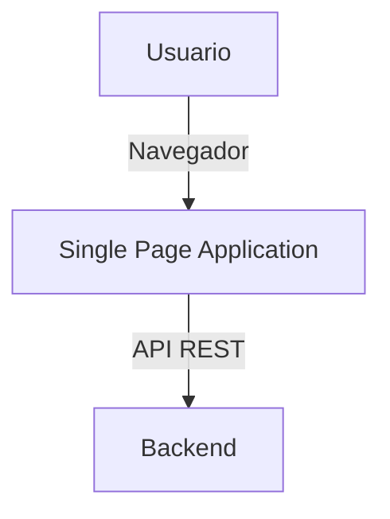

# Arquitectura del Frontend

Este documento describe la arquitectura del frontend del proyecto Precios.

## Diagrama General

## Componentes Principales
- **SPA (Vue.js)**: Aplicación de página única que consume la API del backend.
- **Componentes**: Estructura modular de la interfaz.
- **Rutas**: Navegación interna.
- **Stores**: Gestión de estado global.

## Flujo de Datos
Describir cómo fluye la información desde el usuario hasta el backend y viceversa.

---

- [Volver al README del frontend](./README.md)
- [Definición técnica](./definicion_tecnica.md) 