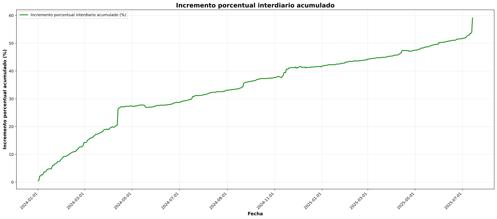

# Incremento acumulado interdiario (precios vs. dólar)

**Descripción resumida:**
Este gráfico muestra, día a día, cómo se van acumulando los aumentos promedio de precios y del dólar. Así podés comparar de un vistazo cuánto subieron (o bajaron) los precios y el dólar en total a lo largo del tiempo.

---

## Detalle metodológico

1. **Obtención de precios y dólar:**
   - Los precios se recolectan automáticamente mediante bots y se exportan en archivos `.csv`.
   - El precio del dólar se obtiene de fuentes públicas y se importa como CSV histórico.

2. **Procesamiento de datos:**
   - Limpieza y validación de los `.csv`.
   - Agrupación de precios por producto y día (mediana), generación de series diarias completas (forward fill).
   - El dólar se ordena y se calcula su variación diaria.

3. **Cálculo de incrementos y acumulados:**
   - Para ambos, se calcula el incremento porcentual diario.
   - Se aplica composición multiplicativa para obtener el acumulado real de precios y dólar.

4. **Construcción del gráfico:**
   - Se grafican ambas curvas acumuladas: precios (verde) y dólar (azul), permitiendo la comparación directa.

---

## Justificación y utilidad

Comparar la evolución acumulada de precios y dólar permite analizar si los precios siguen, superan o quedan por debajo de la devaluación. Es clave para entender el impacto real de la inflación y la relación con el tipo de cambio.

---

> _Transparencia:_ El análisis y la generación de este gráfico fueron asistidos mediante herramientas de inteligencia artificial para asegurar rigurosidad y claridad. 