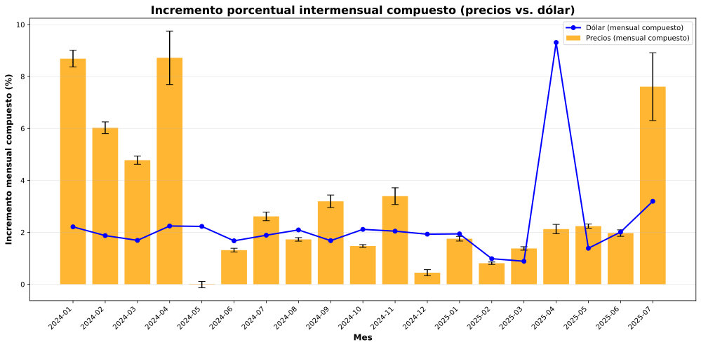

# Incremento porcentual intermensual compuesto

**Descripción:**
Este gráfico muestra el aumento total de precios mes a mes, calculado de forma compuesta (teniendo en cuenta el efecto acumulativo real). Incluye barras de error para mostrar la variabilidad diaria dentro de cada mes.

> _Transparencia:_ El análisis y la generación de este gráfico fueron asistidos mediante herramientas de inteligencia artificial para asegurar rigurosidad y claridad. 