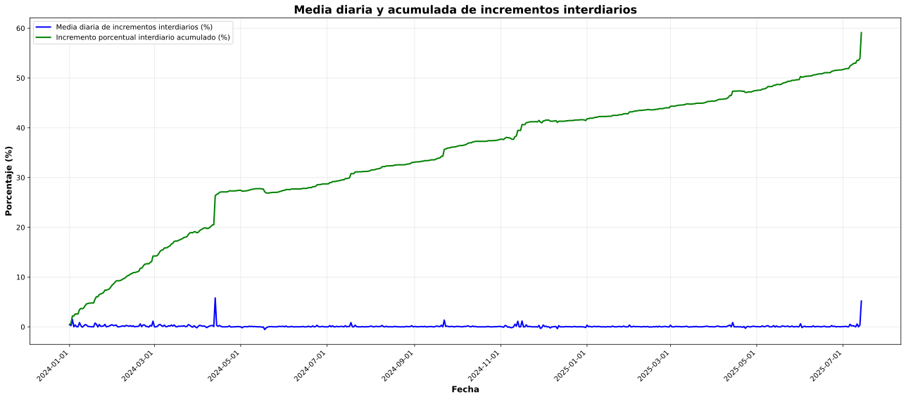

# Gráfico combinado: media diaria y acumulado de incrementos interdiarios

**Descripción:**
En este gráfico podés ver juntos el cambio promedio diario y el acumulado a lo largo del tiempo. Es útil para comparar la tendencia diaria con el efecto total acumulado.

> _Transparencia:_ El análisis y la generación de este gráfico fueron asistidos mediante herramientas de inteligencia artificial para asegurar rigurosidad y claridad. 