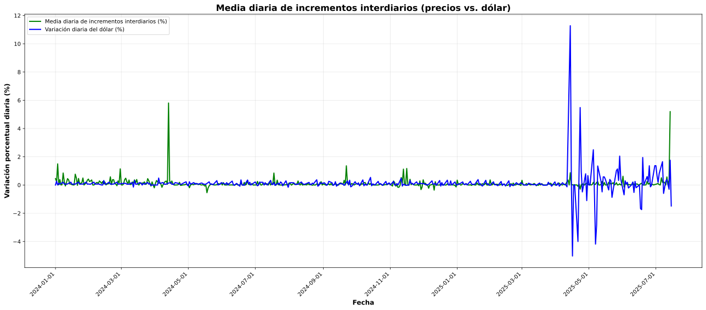

# Media diaria de incrementos interdiarios

**Descripción resumida:**
Este gráfico muestra cómo varían, en promedio, los precios de un día al siguiente. Permite ver si los precios suben o bajan día a día y detectar tendencias generales.

---

## Detalle metodológico

1. **Obtención de precios:**
   Los precios se recolectan automáticamente mediante bots que consultan fuentes públicas y privadas. Los datos se exportan en archivos `.csv` para su posterior análisis.

2. **Procesamiento de datos:**
   - Limpieza y validación de los `.csv`.
   - Agrupación de precios por producto y día, usando la mediana si hay varios valores.
   - Generación de series diarias completas por producto (relleno forward fill).

3. **Cálculo de incrementos diarios:**
   - Se calcula el incremento porcentual entre días consecutivos para cada producto.
   - Se obtiene la media diaria de estos incrementos, aplicando filtros de calidad (≥1000 registros, sin extremos).

4. **Construcción del gráfico:**
   - Se grafica la media diaria de incrementos interdiarios a lo largo del tiempo.

---

## Justificación y utilidad

Este gráfico es útil para detectar tendencias generales de inflación o deflación, identificar períodos de estabilidad o volatilidad y comunicar de forma clara la evolución diaria de los precios.

---

> _Transparencia:_ El análisis y la generación de este gráfico fueron asistidos mediante herramientas de inteligencia artificial para asegurar rigurosidad y claridad. 